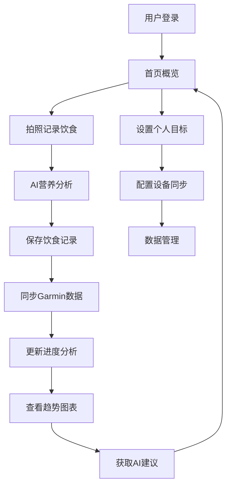

# 脂记 - 减脂追踪应用重构版

## 1. 产品概述

脂记是一款智能减脂进度追踪应用，通过AI技术自动分析饮食营养成分，结合Garmin设备数据同步，为用户提供科学的减脂指导和进度追踪。重构版本将采用现代化的全栈架构，完全部署在Vercel平台上，提供更好的性能和用户体验。

本产品解决了传统减脂应用需要手动输入营养数据的痛点，通过拍照即可获得准确的营养分析，结合运动数据提供个性化的减脂建议。

目标是成为最智能、最便捷的减脂追踪工具，帮助用户科学有效地达成减脂目标。

## 2. 核心功能

### 2.1 用户角色

| 角色 | 注册方式 | 核心权限 |
|------|----------|----------|
| 普通用户 | 邮箱注册或第三方登录 | 基础饮食记录、AI分析、进度查看 |
| 高级用户 | 订阅升级 | 无限AI分析次数、高级数据分析、导出功能 |

### 2.2 功能模块

我们的减脂追踪应用包含以下主要页面：

1. **首页**：用户概览、今日摄入汇总、快速记录入口、进度环形图
2. **饮食记录页**：拍照记录、AI营养分析、手动输入、历史记录
3. **进度分析页**：减脂趋势图表、目标设定、数据统计、日历视图
4. **设备同步页**：Garmin设备连接、运动数据同步、训练类型分析
5. **个人设置页**：用户资料、目标设定、偏好配置、数据导出

### 2.3 页面详情

| 页面名称 | 模块名称 | 功能描述 |
|----------|----------|----------|
| 首页 | 概览仪表板 | 显示今日热量摄入、消耗、剩余目标，快速添加食物按钮 |
| 首页 | 进度环形图 | 可视化显示减脂进度百分比，剩余天数倒计时 |
| 首页 | 快速操作 | 拍照记录、手动添加、同步设备数据的快捷入口 |
| 饮食记录页 | 拍照分析 | 调用相机拍摄食物，上传至AI进行营养成分识别和分析 |
| 饮食记录页 | 营养展示 | 显示热量、蛋白质、碳水、脂肪含量，提供AI建议 |
| 饮食记录页 | 记录管理 | 查看、编辑、删除历史饮食记录，按日期筛选 |
| 进度分析页 | 趋势图表 | 体重变化曲线、热量摄入趋势、营养素比例分析 |
| 进度分析页 | 目标管理 | 设定减脂目标、每日热量目标、预期完成时间 |
| 进度分析页 | 日历视图 | 月历显示每日记录状态，点击查看详细数据 |
| 设备同步页 | Garmin连接 | 授权连接Garmin账户，配置同步频率和数据类型 |
| 设备同步页 | 运动数据 | 显示步数、心率、消耗热量、训练类型识别 |
| 设备同步页 | 数据分析 | 运动与饮食关联分析，提供运动建议 |
| 个人设置页 | 用户资料 | 编辑个人信息、身高体重、活动水平等基础数据 |
| 个人设置页 | 偏好设置 | 营养目标偏好、通知设置、数据隐私配置 |
| 个人设置页 | 数据管理 | 数据导出、备份恢复、账户删除等功能 |

## 3. 核心流程

**普通用户流程**：
用户注册登录 → 设置个人信息和减脂目标 → 拍照记录饮食 → AI自动分析营养成分 → 查看每日摄入汇总 → 连接Garmin设备同步运动数据 → 查看减脂进度和趋势分析 → 根据AI建议调整饮食和运动

**高级用户流程**：
在普通用户基础上 → 无限制AI分析 → 高级数据分析和报告 → 数据导出和备份 → 个性化减脂方案推荐

## 4. 用户界面设计

### 4.1 设计风格

- **主色调**：清新蓝色 (#3b82f6) 和健康绿色 (#10b981)
- **辅助色**：警示橙色 (#f59e0b) 和中性灰色 (#6b7280)
- **按钮风格**：圆角现代风格，支持触觉反馈
- **字体**：Inter字体系列，主要文字16px，标题20-24px
- **布局风格**：卡片式设计，底部导航栏，移动优先响应式
- **图标风格**：线性图标配合实心图标，统一视觉语言

### 4.2 页面设计概览

| 页面名称 | 模块名称 | UI元素 |
|----------|----------|---------|
| 首页 | 概览仪表板 | 渐变背景卡片，环形进度条，数字动画效果，快速操作浮动按钮 |
| 首页 | 进度环形图 | SVG动画环形图，中心显示百分比，颜色渐变表示进度状态 |
| 饮食记录页 | 拍照分析 | 全屏相机界面，拍照按钮动画，上传进度指示器 |
| 饮食记录页 | 营养展示 | 营养成分条形图，颜色编码不同营养素，AI建议气泡提示 |
| 进度分析页 | 趋势图表 | Chart.js响应式图表，多色线图，交互式数据点 |
| 设备同步页 | Garmin连接 | 设备状态指示灯，连接按钮，同步进度条 |
| 个人设置页 | 用户资料 | 表单输入组件，滑动选择器，开关切换按钮 |

### 4.3 响应式设计

产品采用移动优先的响应式设计，主要针对手机端优化，同时兼容平板和桌面端。支持触摸手势操作，包括滑动、长按、双击等交互方式。