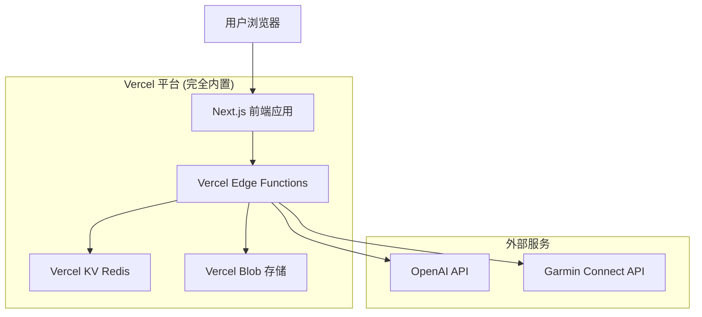
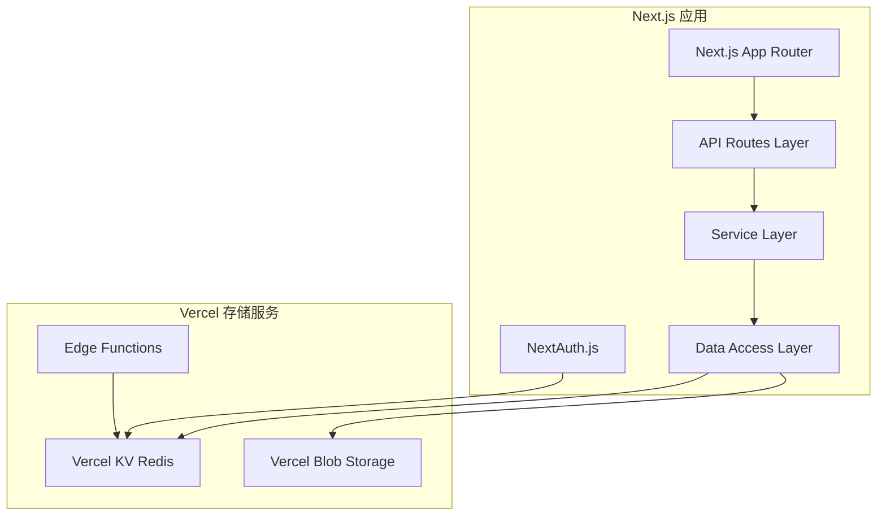

# 脂记重构版 - 技术架构文档

## 1. 架构设计



## 2. 技术描述

- **前端**: Next.js 14 + React 18 + TypeScript + Tailwind CSS
- **后端**: Vercel Edge Functions + Node.js Runtime
- **数据存储**: Vercel KV (Redis) - 完全替代传统数据库
- **文件存储**: Vercel Blob - 用于食物图片存储
- **用户认证**: NextAuth.js + Vercel KV 会话存储
- **AI服务**: OpenAI GPT-4 Vision API
- **设备集成**: Garmin Connect IQ API
- **部署**: Vercel 全栈一体化部署

### 使用纯Vercel生态的优势：
- ✅ **零配置部署** - 无需配置外部数据库和服务
- ✅ **成本更低** - 按使用量付费，无固定月费
- ✅ **性能更好** - Edge网络全球分布，延迟更低
- ✅ **维护简单** - 统一Vercel控制台管理所有服务
- ✅ **自动扩展** - 根据流量自动调整资源

## 3. 路由定义

| 路由 | 用途 |
|------|-----|
| / | 首页，显示用户概览和快速操作入口 |
| /food | 饮食记录页面，拍照分析和记录管理 |
| /progress | 进度分析页面，图表展示和目标管理 |
| /sync | 设备同步页面，Garmin数据同步配置 |
| /settings | 个人设置页面，用户资料和偏好配置 |
| /login | 登录页面，支持邮箱和第三方登录 |
| /register | 注册页面，用户账户创建 |

## 4. API定义

### 4.1 核心API

**用户认证相关 (NextAuth.js)**
```
POST /api/auth/signin
GET /api/auth/session
POST /api/auth/signout
```

NextAuth.js 自动处理认证流程，支持：
- 邮箱密码登录
- Google/GitHub 第三方登录
- 会话管理存储在 Vercel KV

会话数据结构:
| 参数名 | 参数类型 | 描述 |
|--------|----------|------|
| user | object | 用户基本信息 |
| expires | string | 会话过期时间 |
| accessToken | string | 访问令牌 |

**饮食记录相关**
```
POST /api/food/analyze
```

请求:
| 参数名 | 参数类型 | 是否必填 | 描述 |
|--------|----------|----------|------|
| image | string | false | Base64编码的食物图片 |
| description | string | false | 食物文字描述 |

响应:
| 参数名 | 参数类型 | 描述 |
|--------|----------|------|
| calories | number | 热量(kcal) |
| protein | number | 蛋白质(g) |
| carbs | number | 碳水化合物(g) |
| fat | number | 脂肪(g) |
| advice | string | AI营养建议 |

**Garmin数据同步**
```
GET /api/garmin/sync
```

请求:
| 参数名 | 参数类型 | 是否必填 | 描述 |
|--------|----------|----------|------|
| force | boolean | false | 是否强制同步 |

响应:
| 参数名 | 参数类型 | 描述 |
|--------|----------|------|
| totalCalories | number | 总消耗热量 |
| steps | number | 步数 |
| heartRate | object | 心率数据 |
| activities | array | 运动活动列表 |

示例响应:
```json
{
  "success": true,
  "data": {
    "totalCalories": 2450,
    "steps": 8500,
    "heartRate": {
      "resting": 65,
      "max": 180,
      "average": 85
    },
    "activities": [
      {
        "name": "晨跑",
        "type": "running",
        "duration": 30,
        "calories": 350
      }
    ]
  }
}
```

## 5. 服务器架构图



## 6. 数据模型 (基于 Vercel KV Redis)

### 6.1 Redis 数据结构设计

```mermaid
graph TD
  A[Vercel KV Redis] --> B[用户数据]
  A --> C[饮食记录]
  A --> D[Garmin数据]
  A --> E[每日汇总]
  A --> F[会话存储]

  B --> B1[user:{userId}:profile]
  C --> C1[user:{userId}:foods:{date}]
  C --> C2[user:{userId}:foods:index]
  D --> D1[user:{userId}:garmin:{date}]
  E --> E1[user:{userId}:summary:{date}]
  F --> F1[nextauth:session:{sessionId}]
```

### 6.2 Redis 键值结构定义

**用户资料存储**
```typescript
// Key: user:{userId}:profile
// Type: Hash
interface UserProfile {
  id: string;
  email: string;
  name: string;
  height: number;
  currentWeight: number;
  targetWeight: number;
  dailyCalorieGoal: number;
  activityLevel: 'low' | 'moderate' | 'high';
  createdAt: string;
  updatedAt: string;
}

// Redis 操作示例
await kv.hset(`user:${userId}:profile`, {
  name: "张三",
  height: 175,
  currentWeight: 75,
  targetWeight: 65,
  dailyCalorieGoal: 2000,
  activityLevel: "moderate"
});
```

**饮食记录存储**
```typescript
// Key: user:{userId}:foods:{date}
// Type: Hash (每个记录ID作为field)
interface FoodRecord {
  id: string;
  recordDate: string;
  recordTime: string;
  description: string;
  calories: number;
  protein: number;
  carbs: number;
  fat: number;
  aiAdvice: string;
  imageUrl?: string;
  createdAt: string;
}

// Key: user:{userId}:foods:index
// Type: Sorted Set (按日期排序的记录索引)
await kv.zadd(`user:${userId}:foods:index`, {
  score: Date.now(),
  member: `${date}:${recordId}`
});
```

**Garmin数据存储**
```typescript
// Key: user:{userId}:garmin:{date}
// Type: Hash
interface GarminData {
  syncDate: string;
  totalCalories: number;
  activeCalories: number;
  steps: number;
  heartRate: {
    resting: number;
    max: number;
    average: number;
  };
  activities: Array<{
    name: string;
    type: string;
    duration: number;
    calories: number;
  }>;
  trainingType: 'none' | 'A' | 'S' | 'both';
  syncedAt: string;
}
```

**每日汇总存储**
```typescript
// Key: user:{userId}:summary:{date}
// Type: Hash
interface DailySummary {
  summaryDate: string;
  totalCaloriesIn: number;
  totalCaloriesOut: number;
  totalProtein: number;
  totalCarbs: number;
  totalFat: number;
  trainingType: string;
  weightChange: number;
  createdAt: string;
  updatedAt: string;
}
```

**NextAuth.js 会话存储**
```typescript
// Key: nextauth:session:{sessionId}
// Type: Hash
// NextAuth.js 自动管理会话数据
interface Session {
  user: {
    id: string;
    email: string;
    name: string;
  };
  expires: string;
  accessToken: string;
}
```

### 6.3 数据操作示例

**保存饮食记录**
```typescript
import { kv } from '@vercel/kv';

async function saveFoodRecord(userId: string, record: FoodRecord) {
  const date = record.recordDate;
  const recordKey = `user:${userId}:foods:${date}`;
  const indexKey = `user:${userId}:foods:index`;
  
  // 保存记录
  await kv.hset(recordKey, record.id, JSON.stringify(record));
  
  // 更新索引
  await kv.zadd(indexKey, {
    score: new Date(record.createdAt).getTime(),
    member: `${date}:${record.id}`
  });
}
```

**获取用户饮食记录**
```typescript
async function getFoodRecords(userId: string, date: string) {
  const recordKey = `user:${userId}:foods:${date}`;
  const records = await kv.hgetall(recordKey);
  
  return Object.values(records).map(record => 
    JSON.parse(record as string)
  );
}
```

**更新每日汇总**
```typescript
async function updateDailySummary(userId: string, date: string) {
  const records = await getFoodRecords(userId, date);
  const garminData = await kv.hgetall(`user:${userId}:garmin:${date}`);
  
  const summary = {
    summaryDate: date,
    totalCaloriesIn: records.reduce((sum, r) => sum + r.calories, 0),
    totalCaloriesOut: garminData?.totalCalories || 0,
    totalProtein: records.reduce((sum, r) => sum + r.protein, 0),
    totalCarbs: records.reduce((sum, r) => sum + r.carbs, 0),
    totalFat: records.reduce((sum, r) => sum + r.fat, 0),
    updatedAt: new Date().toISOString()
  };
  
  await kv.hset(`user:${userId}:summary:${date}`, summary);
}